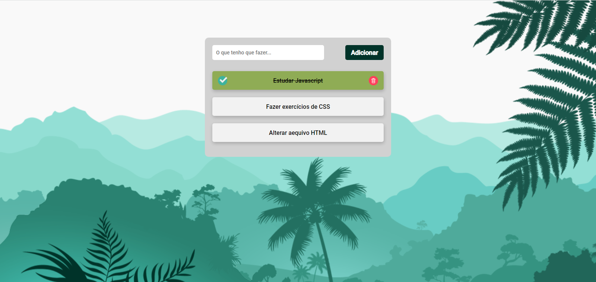

<h1 align="center"> Task List </h1>

Programa apresentado no canal Rodolfo Mori no Youtube para ensino de tecnologias WEB.  
<a href="https:https://www.youtube.com/watch?v=k0roUpojoSE&t=596s">Estude esse projeto em formato de vídeo clicando aqui.</a>

  <a href="#-tecnologias">Tecnologias</a>&nbsp;&nbsp;&nbsp;|&nbsp;&nbsp;&nbsp;
  <a href="#-projeto">Projeto</a>&nbsp;&nbsp;&nbsp;|&nbsp;&nbsp;&nbsp;
  <a href="#-layout">Layout</a>&nbsp;&nbsp;&nbsp;|&nbsp;&nbsp;&nbsp;
  <a href="#memo-licença">Licença</a>

 

  

## 🚀 Tecnologias

Esse projeto foi desenvolvido com as seguintes tecnologias:

- HTML e CSS
- JavaScript
- Git e Github

## 💻 Projeto

O Task List é uma agenda de listas de tarefas, para gerenciamento de suas tarefas online.
Utilizei para estudo e aprendizado de manipulação de Arrays, JSON, Local Storage, e demais ferramentas.

---

Feito com ♥ by Wellington Sato